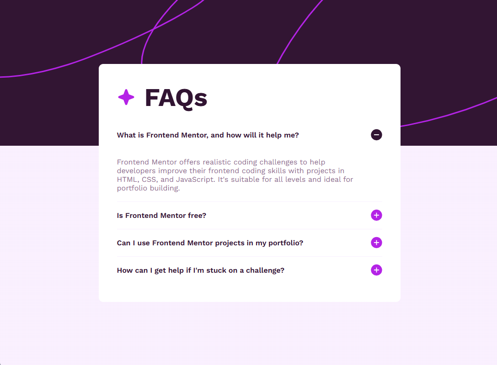

# FAQs Accordion

Olá 👋  
Obrigada por conferir essa solução de desafio!

👉 Visualize clicando [aqui](https://roberta-silva.github.io/frontend-mentor-desafios/faq-accordion/).

## Sobre

Página de FAQ com o objetivo de praticar HTML, CSS e JavaScript, utilizando um accordion interativo.

## Tecnologias e Conceitos Utilizados

- HTML5
- CSS3
- JavaScript (accordion interativo)
- Responsividade com media queries
- Efeitos com `:hover`

---
