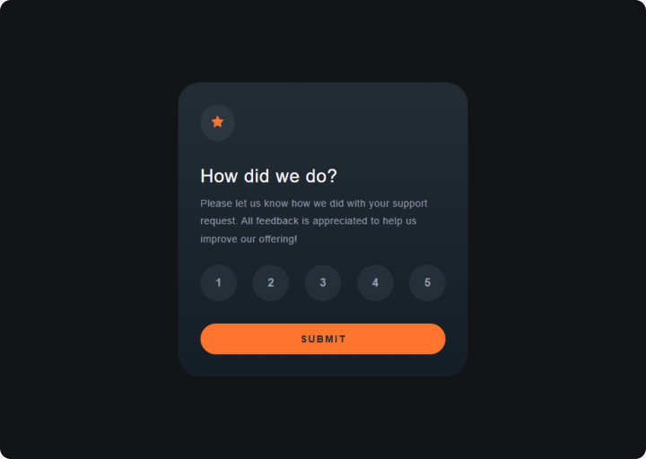

Olá 👋 Obrigada por conferir a solução para esse desafio!

# Interactive Rating Component

Componente interativo de avaliação, desenvolvido para praticar manipulação do DOM com JavaScript, estados de interação, organização de layout com CSS e responsividade, seguindo fielmente o design proposto pelo **Frontend Mentor**.

👉 [Visualize minha solução aqui](https://roberta-silva.github.io/frontend-mentor-desafios/interactive-rating-component/)

👉 [Visualize o desafio original aqui!](https://www.frontendmentor.io/solutions/interactive-rating-component-usando-html-css-e-javascript-f3_oTjA30w)

## 🔹 Objetivo do Projeto

- Reproduzir com precisão o design visual do desafio, respeitando cores, tipografia, espaçamentos e hierarquia.
- Praticar JavaScript básico para interação com o usuário e controle de estados.
- Garantir responsividade, mantendo boa experiência em diferentes tamanhos de tela.
- Trabalhar organização de código, clareza semântica e boas práticas de Front-end.

## 🔹 O desafio

Os usuários devem ser capazes de:

- Visualizar o layout ideal do app dependendo do tamanho da tela do dispositivo
- Ver os estados de hover de todos os elementos interativos da página
- Selecionar e enviar uma avaliação numérica
- Ver o estado do cartão **"Obrigado"** após enviar a avaliação

## 🔹 Funcionalidades

- Seleção de apenas uma opção de avaliação (1 a 5).
- Feedback visual para o botão selecionado.
- Envio da avaliação via botão _Submit_.
- Troca dinâmica entre o cartão de avaliação e o cartão de agradecimento.
- Layout totalmente responsivo (desktop e mobile).
- Uso de HTML semântico, melhorando acessibilidade e legibilidade.

## 🔹 Tecnologias Utilizadas

- HTML5
- CSS3
- JavaScript
- Design responsivo

## 🔹 Resultado

O projeto entrega um componente interativo, visualmente consistente e responsivo, demonstrando domínio dos fundamentos de Front-end, atenção aos detalhes de UI e evolução no uso de JavaScript para criar experiências dinâmicas e funcionais.
