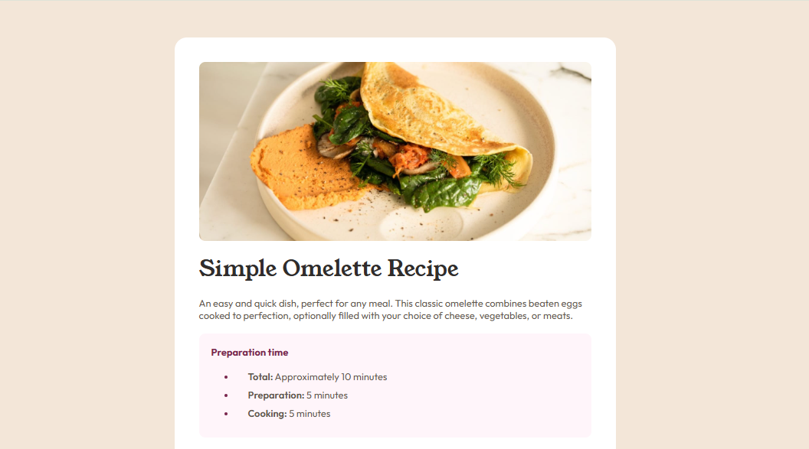

Olá 👋 Obrigada por conferir a solução para esse desafio!

# Recipe Page ✨

Página de receita estruturada com **HTML semântico** e **CSS flexível**, enfatizando a **usabilidade e experiência do usuário** em diferentes dispositivos.

### 👉 [Visualize minha solução aqui](https://roberta-silva.github.io/frontend-mentor-desafios/recipe-page/) & [Visualize o desafio original aqui](https://www.frontendmentor.io/challenges/recipe-page-KiTsR8QQKm)!

## Objetivo do Projeto 📌

- Replicar fielmente o design proposto pelo desafio, mantendo estética, hierarquia visual e layout sugeridos.
- Praticar **HTML semântico** e **CSS responsivo**, garantindo boa experiência em diferentes dispositivos.
- Priorizar **usabilidade e acessibilidade**, facilitando a leitura e navegação das receitas.

## Funcionalidades 🚀

- Layout **responsivo**, adaptando-se a telas de desktop, tablet e mobile.
- Uso de **HTML semântico**, melhorando a estrutura do código e SEO.
- **Estilização moderna** com CSS, incluindo cores, tipografia e espaçamento consistentes.

## Tecnologias Utilizadas

`HTML5` · `CSS3` · `Design responsivo`

## Resultado

O projeto entrega uma **página de receita funcional, clara e acessível**, demonstrando boas práticas de desenvolvimento Front-end e atenção a detalhes de design e experiência do usuário.
