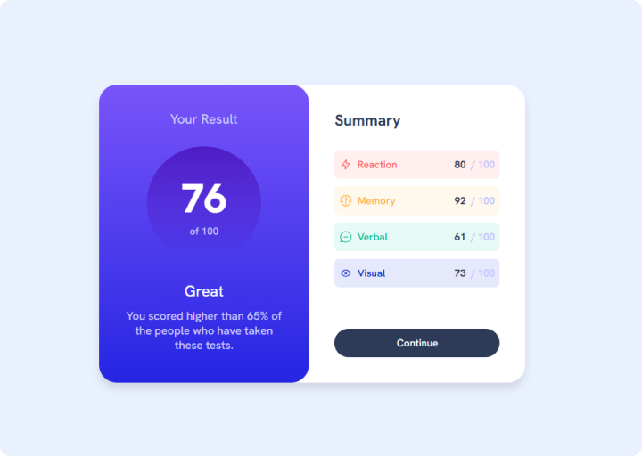

Olá 👋 Obrigada por conferir a solução para esse desafio!

# Results Summary Component 📊

Componente de **resumo de resultados**, desenvolvido para praticar **layout com CSS**, **organização visual de dados** e **responsividade**, seguindo fielmente o design proposto pelo Frontend Mentor.

### 👉 [Visualize minha solução aqui](https://roberta-silva.github.io/frontend-mentor-desafios/results-summary-component/) & [Visualize o desafio original aqui](https://www.frontendmentor.io/challenges/results-summary-component-CE_K6s0maV)!

## Objetivo do Projeto 📌

- Reproduzir com precisão o **design visual** do desafio, respeitando cores, tipografia, espaçamentos e hierarquia.
- Praticar **CSS moderno**, incluindo flexbox, alinhamentos e controle de layout.
- Garantir **responsividade**, mantendo boa experiência em diferentes tamanhos de tela.
- Trabalhar a **organização de componentes** e clareza na apresentação de informações.

## Funcionalidades 🚀

- Exibição clara e organizada do **resultado geral** e **pontuações por categoria**.
- Efeitos interativos com `:hover`, trazendo feedback visual ao usuário.
- Layout **responsivo**, adaptado para desktop e mobile.
- Uso de **HTML semântico**, melhorando legibilidade e estrutura do código.
- **Estilização fiel ao design**, com atenção a cores, tipografia e contrastes.

## Tecnologias Utilizadas

`HTML5` · `CSS3` · `Design responsivo`

## Resultado

O projeto entrega um **componente visualmente consistente, responsivo e bem estruturado**, demonstrando atenção aos detalhes de design, domínio de **CSS para layout** e boas práticas de desenvolvimento Front-end.
