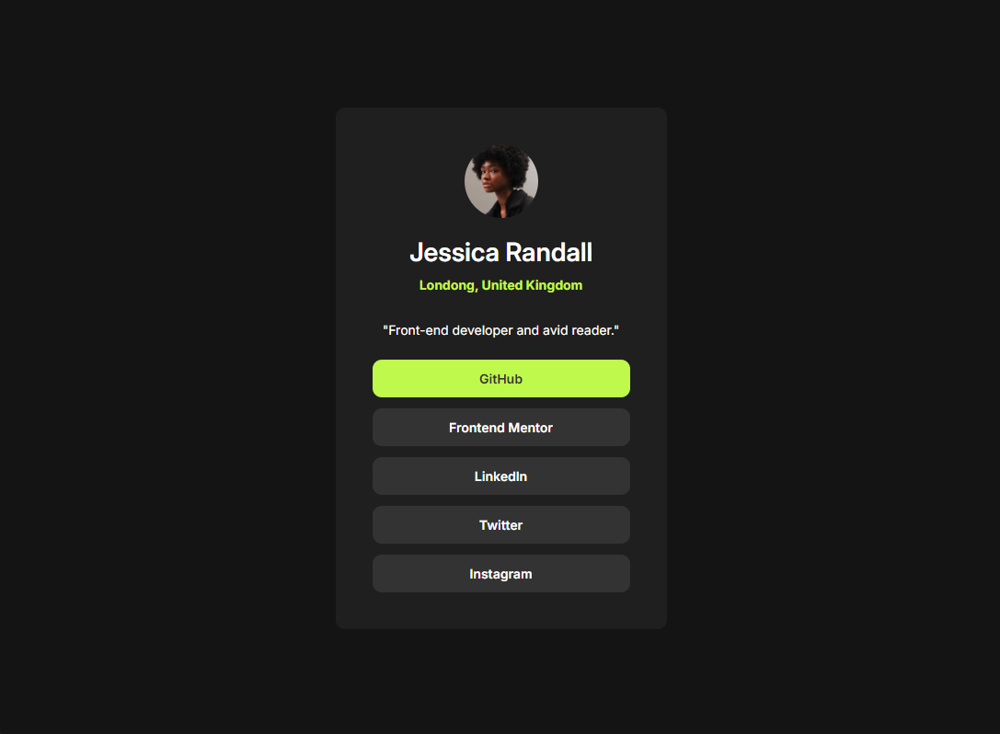

Olá 👋 Obrigada por conferir a solução para esse desafio!

# Social Links Profile ✨

Esta página de perfil exibe links sociais de forma organizada e acessível, combinando **HTML semântico**, **CSS moderno** e **design responsivo**.

### 👉 [Visualize minha solução aqui](https://roberta-silva.github.io/frontend-mentor-desafios/social-links-profile/) & [Visualize o desafio original aqui](https://www.frontendmentor.io/challenges/social-links-profile-UG32l9m6dQ)!

## Objetivo do Projeto 📌

- Replicar fielmente o design proposto pelo desafio, mantendo a estética e a organização visual sugeridas.
- Praticar **HTML semântico** e **CSS responsivo**, garantindo boa experiência em diferentes dispositivos.
- Priorizar **acessibilidade**, clareza de conteúdo e usabilidade.

## Funcionalidades 🚀

- Layout **responsivo**, adaptando-se a telas de desktop, tablet e mobile.
- Uso de **HTML semântico**, melhorando a estrutura do código e SEO.
- **Estilização moderna** com CSS, incluindo cores, tipografia e espaçamento consistentes.
- Efeitos com **:hover**.

## Tecnologias Utilizadas

`HTML5` · `CSS3` · `Design responsivo`

## Resultado

O projeto entrega uma **página de perfil limpa, acessível e funcional**, demonstrando boas práticas de desenvolvimento Front-end e atenção a detalhes de design e usabilidade.
